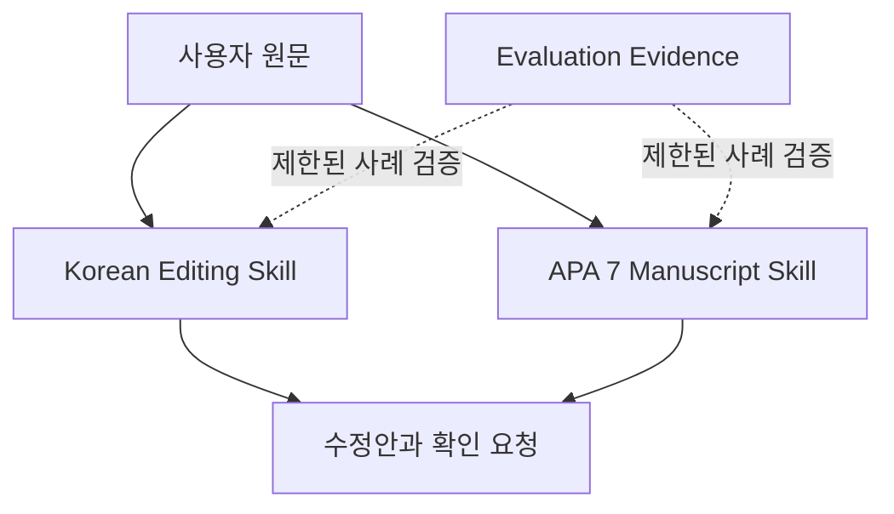

# Architecture

`korean-writing-skills`는 실행 서비스가 아니라 두 개의 독립적인 Agent Skill과
그 한계를 확인하는 평가 증거를 배포하는 문서 제품이다. 사용자 원문과 연구
자료는 이 repository가 소유하거나 저장하지 않는다.

## Context Map

- **Korean Editing Context**: 의미·수치·불확실성·인용을 보존하며 한국어
  문장과 문단을 고친다.
- **APA 7 Manuscript Context**: 직접 확인한 APA 7·JARS 범위 안에서 원고
  작성과 점검 절차를 제공한다.
- **Evaluation Evidence Context**: 동결 입력, 판본, 출력, 채점, 한계를
  기록한다. 개별 합성 사례의 통과를 전체 타당화로 승격하지 않는다.
- **External Evidence Policy Boundary**: 국립국어원·APA·Zotero 등 외부
  자료는 source ledger에 확인 범위와 접근 상태를 먼저 기록한다. 현재 자동
  `tests/source_traceability_test.py`가 본문에 인용된 출처 ID가 같은 스킬의
  장부(또는 `korean-editing K2`처럼 소유 스킬을 밝힌 다른 장부)에 정의되어
  있는지만 fail-closed로 검사한다. 장부 내용이 원문을 정확히 읽었는지, 규칙이
  출처로 뒷받침되는지는 검사하지 않는다.

## 책임과 불변 조건

| 구성요소 | 책임 | 불변 조건 |
| --- | --- | --- |
| `skills/korean-editing/` | 한국어 퇴고 절차와 근거 | 원문 의미와 주장 강도를 임의로 바꾸지 않음 |
| `skills/apa7-manuscript-writing/` | APA 7 원고 절차와 근거 | 미확인 절·쪽을 확인한 규칙처럼 쓰지 않음 |
| `evaluations/` | 제한된 행동·회귀 증거 | 입력·판본·출력·채점·한계를 함께 보존 |
| `tests/` | 공개 hygiene·구조·출처 ID 추적 계약 | 로컬 경로·ephemeral ID·운영 ledger 재유입 차단, 정의 없는 출처 ID 인용 차단 |
| `scripts/package_skills.py` | 제한 범위 preview ZIP과 해시 manifest 작성 | 원본 스킬·내부 링크 검증, 두 독립 패키지, 결정적 digest. 공식 release나 자동 교정 서비스가 아님 |

별도 서비스, DB, UI, 인증, 네트워크 런타임은 없다. 그런 책임이 생기면 이
repository에 억지로 넣지 말고 별도 운영 경계와 ADR을 먼저 정의한다.
