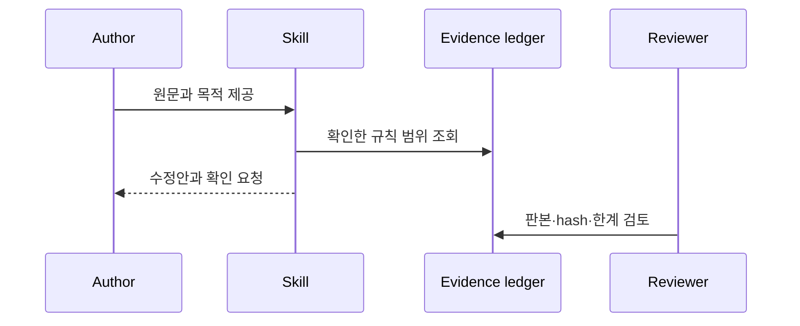

# Product and Technical Gap Baseline

기준 시점: 2026-10-01

관찰 기준: `main@ca94600ed058c0e7448ac69a537b8453241d139b`, PR #4
`1e7786f5dd05c4910f22b7acf05d44d0d702b803`에서 시작한 ordinary descendant

상태: Proposed

## Goal과 Loop

**Goal**: 출처 범위를 과장하지 않고 의미를 보존하는 한국어 퇴고와 APA 7
원고 작성 Agent Skill을 독립적으로 설치·검토할 수 있게 한다.

**Loop**: 원문 직접 확인 → source ledger 갱신 → 규칙 최소 수정 → 동결된 합성
사례와 독립 채점 → 공개 hygiene·CI·review → 보호 브랜치 병합 → immutable
release.

## PRD

| 사용자 | 해야 할 일 | 수용 기준 | 상태 |
| --- | --- | --- | --- |
| 한국어 저자·편집자 | 의미를 보존하며 문장·문단 퇴고 | 수치·불확실성·인용 보존, 과잉 교정 방지 | Proposed |
| 학술 저자 | 확인된 APA 7·JARS 범위로 원고 점검 | 확인 절·쪽과 미확인 범위를 구분 | Proposed |
| 검토자 | 평가 주장의 근거와 한계를 재구성 | 입력·판본·출력·채점·hash·한계 연결 | Partial |

## TRD

- 배포 단위: `skills/korean-editing/`, `skills/apa7-manuscript-writing/`.
- 근거 정책 경계: 각 skill의 `references/source-ledger.md`; 자동 traceability는 미구현.
- 검증 경계: `evaluations/`, `tests/public_hygiene_test.sh`,
  `tests/skill_structure_test.py`.
- 금지 경계: 사용자 원문·참여자 자료·비밀정보와 검사에 열거한 workstation
  절대경로·ephemeral ID 형식.
- 현재 실행 서비스, DB, UI, 인증, container와 network API는 없다.

## UML과 Context Map

Context Map과 구성요소 책임은 `ARCHITECTURE.md`가 소유한다. 처리 순서는
다음과 같다.

## ERD

DB를 소유하지 않으므로 ERD는 적용하지 않는다. 파일 기반 근거를 DB 권위로
가장하지 않는다. 향후 영속 서비스가 생기면 최소 3NF 스키마와 보존·삭제
계약을 별도 ADR에서 정의한다.

## Gap와 Action

| Gap | Evidence | Action | Status |
| --- | --- | --- | --- |
| 보호 브랜치에 제품 구현이 없음 | `main@ca94600e…`, PR #4 | exact-head 검사·비작성자 review 후 ordinary merge | Blocked |
| public hygiene가 수동 grep에 의존 | PR #4 본문과 과거 runtime artifact | `tests/public_hygiene_test.sh`를 필수 검증으로 실행 | In progress |
| Skill 독립 설치 시 repository 외부 문맥에 의존할 수 있음 | `skills/korean-editing/SKILL.md`의 평가 rubric 링크 | package 밖 상대 링크를 fail-closed 검사하고 평가 증거는 실행 의존성에서 분리 | Implemented on PR head |
| 최신 head의 독립 review 부재 | 현재 review는 head 이전 COMMENTED | 새 head에서 review 재요청 | Blocked |
| outbound LICENSE 미정 | root LICENSE 없음 | 저작권·외부 자료 경계 확인 후 조직 소유자가 결정 | Open |
| APA 원문 확인 범위 불완전 | `TODO.md`, APA source ledger | 필요한 절만 직접 확인하고 미확인은 유지 | In progress |
| 평가의 일반화 근거 부족 | 사례별 1회·자기보고 한계 | 반복·독립 채점 설계를 별도 계획으로 확장 | Open |
| 규칙↔source ID 추적이 수동 | source ledger와 SKILL.md | traceability validator 설계·fixture 추가 | Open |
| immutable 배포 계약 부재 | release/tag 0개 | manifest·version·digest·SBOM·provenance·clean-install conformance·rollback 절차 정의 | Open |
| Issue #2가 폐기된 PR #1을 가리킴 | Issue #2 본문 | PR #4 successor와 현재 acceptance를 기록 | In progress |

## Release gate

PR #4의 모든 유효 delta가 보호 브랜치에 통합되고, exact-head 검사와 독립
review가 끝나며, release artifact가 생성되기 전에는 GitHub Pages 공개·제품
완료·APA 준수·전체 타당화를 주장하지 않는다.
